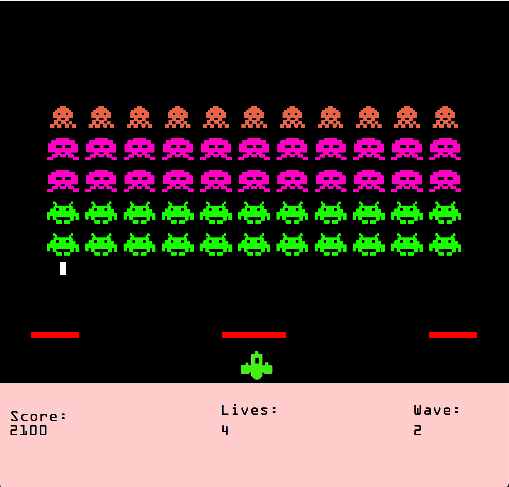

# 🚀 Space Invaders

## 🎮 About

A complete recreation of the iconic Space Invaders game built with **Java Swing**. This project was developed in **Apache NetBeans** and includes full IDE configuration for immediate setup. Defend Earth from alien invaders with classic gameplay, progressive difficulty, and bonus UFO ships!


## 🎮 Features
- **Classic Gameplay**: Faithful recreation of the original Space Invaders experience
- **Score System**: Track your high score as you play
- **Multiple Waves**: Increasingly difficult enemy waves
- **UFO Bonus Ship**: Shoot the randomly spawning UFO for bonus points!
- **Smooth Controls**: Responsive keyboard controls
- **Lives System**: Three lives to defend Earth

## 🕹️ Controls
| Key | Action |
|-----|--------|
| **A/D** | Move spaceship left/right |
| **S** | Plant spaceship in place |
| **Spacebar** | Fire laser |
| **ESC** | Quit game and return to homescreen |

## 🚀 How to Run in Terminal/Command Line
```bash
# Clone the repository
git clone https://github.com/garishan06/SpaceInvaders.git

# Navigate to project directory
cd SpaceInvaders

# Compile all Java files
javac src/space/invaders/*.java

# Run the game
java -cp src space.invaders.frmGame
